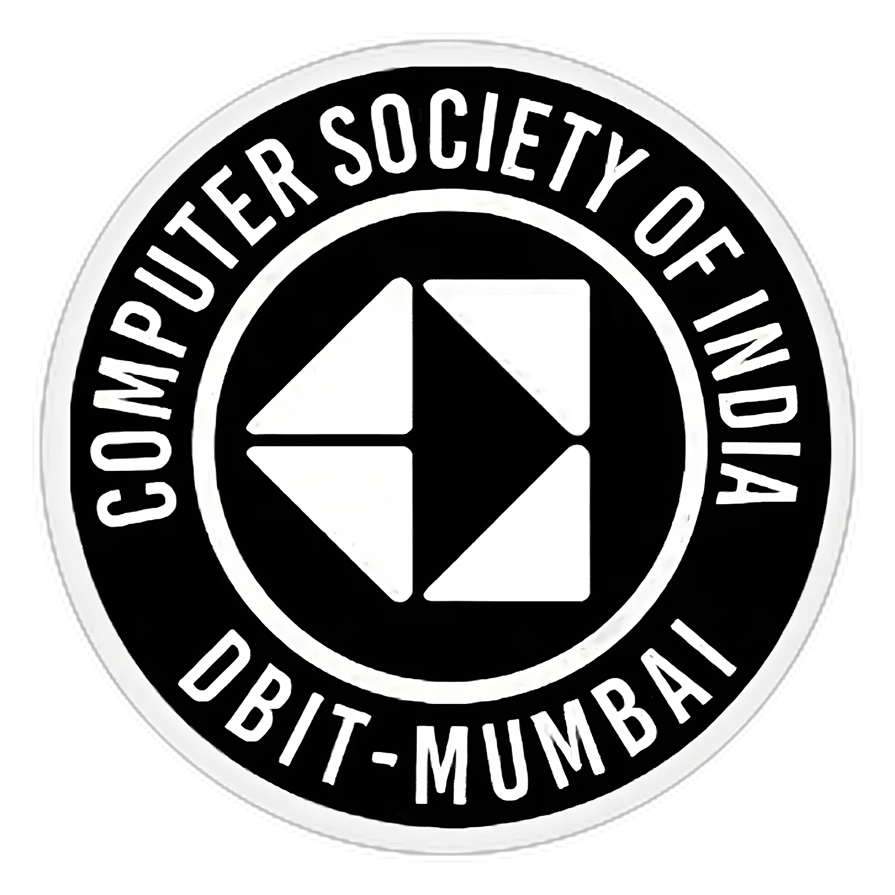
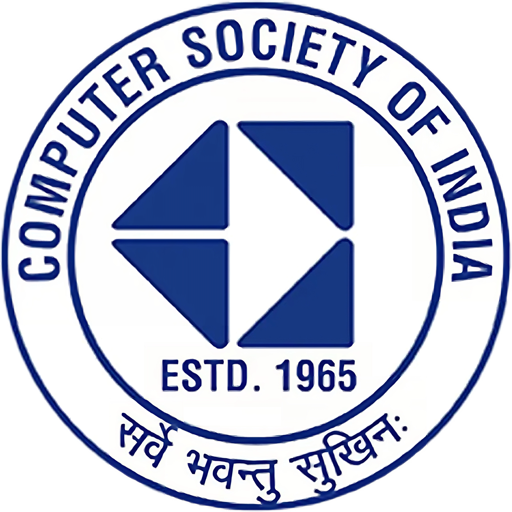
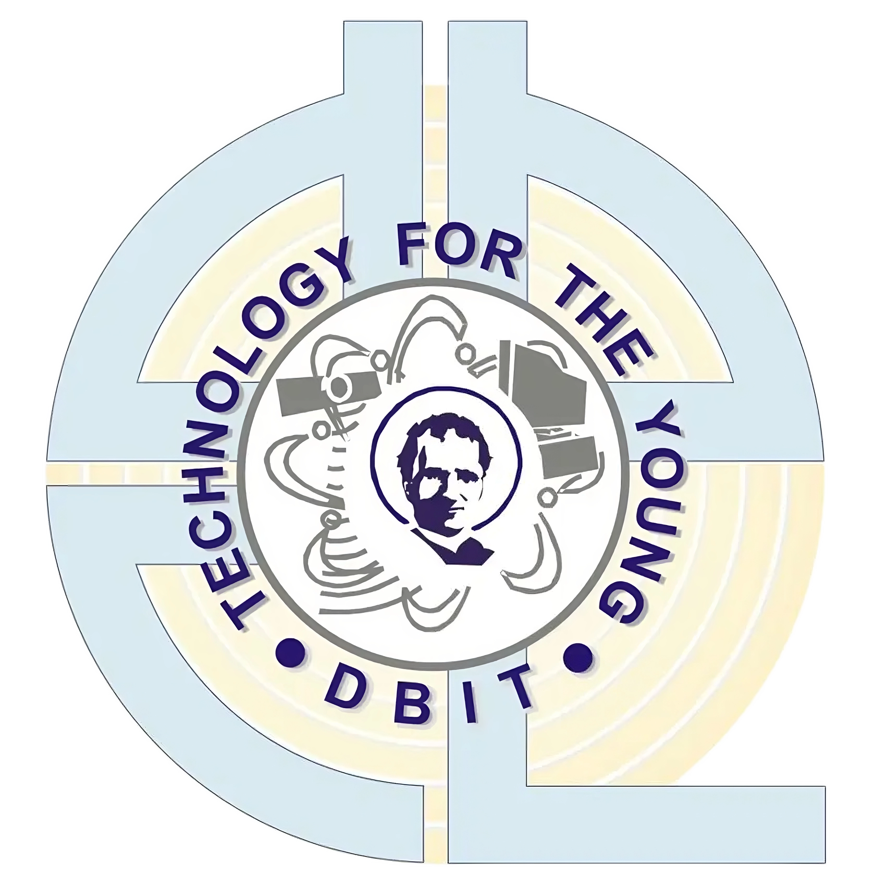

# Computer Society of India DBIT - Official Website

Welcome to the official website of the Computer Society of India (CSI) DBIT Chapter! This website serves as the central hub for all information related to our technical club at Don Bosco Institute of Technology (DBIT). We are a proud sub-branch under the esteemed Computer Society of India, and our mission is to foster a passion for technology and innovation among our members.

## About Us

At CSI DBIT, we are dedicated to promoting and enhancing technical knowledge and skills among our members. We organize a wide range of events, workshops, seminars, and competitions to provide a platform for students to learn, collaborate, and excel in the ever-evolving field of technology.

### Key Features

- **Technical Workshops:** We conduct hands-on workshops on various cutting-edge technologies, helping students gain practical knowledge and experience.

- **Guest Lectures:** We invite industry experts and renowned speakers to share their insights and knowledge, keeping our members updated with the latest trends and developments.

- **Hackathons and Coding Challenges:** We encourage and nurture the programming skills of our members through coding competitions and hackathons.

- **Projects and Research:** We provide opportunities for students to work on real-world projects and research, fostering innovation and creativity.

- **Networking:** CSI DBIT offers a platform for students to network with like-minded individuals, peers, and professionals in the tech industry.

## Getting Started

### Visit Our Website

You can access our official website at [https://www.csi.dbit.in](https://www.csi.dbit.in). Explore the website to find:

- **Upcoming Events:** Stay updated on our latest events, workshops, and seminars.

- **Membership Information:** Learn about the benefits of becoming a CSI DBIT member and how to join us.

- **Contact Us:** Reach out to us with your queries, suggestions, or collaboration proposals.

### Join Our Community

To become a part of the CSI DBIT community, you can:

1. **Attend Our Events:** Check out our events calendar on the website and attend the ones that interest you.

2. **Become a Member:** Joining as a member offers exclusive benefits such as access to members-only events and resources. Details can be found on our website [csi-membership](https://csi.dbit.in/csi-membership.html)

3. **Follow Us on Social Media:** Stay connected with us on social media platforms for regular updates and announcements.
<p align='left'>
&nbsp;&nbsp;&nbsp;&nbsp;&nbsp;&nbsp;
  <a margin="1rem" target="blank" href="https://www.linkedin.com/company/computer-society-of-india-csi-dbit" ></a>
  <a margin="1rem" target="blank" href="https://www.instagram.com/csidbit/" ></a>
  <a margin="1rem" target="blank" href="https://twitter.com/csidbit"></a>
  <a margin="1rem" target="blank" href="https://www.youtube.com/c/CSIDBIT" ></a>
  <a margin="1rem" target="blank" href="https://www.facebook.com/csidbit/" ></a>
</p>
## Contributing

We welcome contributions from members and the broader tech community. If you have ideas for new projects, workshops, or events, or if you'd like to contribute to our website repository, here's how you can get involved:

1. **Fork the Repository:** Start by forking our website repository from [GitHub](https://github.com/CSI-DBIT/csi_website).

2. **Clone the Repository:** Clone your forked repository to your local machine using the following command:
   ```
   git clone https://github.com/CSI-DBIT/csi_website.git
   ```

3. **Make Changes:** Make your desired changes to the code or content. You can work on new features, fix bugs, or update existing information.

4. **Commit Your Changes:** Commit your changes with clear and descriptive commit messages.

5. **Push to Your Fork:** Push your changes to your forked repository on GitHub (**Branch name must follow the given standard**).
   ```
   git push origin yourName-featureName
   ```

6. **Create a Pull Request:** Create a pull request (PR) from your forked repository to the original CSI DBIT repository. Describe your changes and provide any additional context.

7. **Review and Collaboration:** Your PR will be reviewed by our team. Collaborate with us to address any feedback or changes required.

8. **Merge and Deployment:** Once your PR is approved, it will be merged into the main website repository and deployed to our official website.

9. **Delete Branches** Once Merging & reviewing is done all merged branches must be deleted by the handler.


## Contact Us

If you have any questions, suggestions, or would like to collaborate with us, please don't hesitate to get in touch:

- Email: [contact@csi.dbit.in](mailto:csidbit@gmail.com)

We look forward to having you as a part of our vibrant tech community!

<p align='left'>
&nbsp;&nbsp;&nbsp;&nbsp;&nbsp;&nbsp;
  <a margin="1rem" target="blank" href="https://csi.dbit.in/" ></a>
  <a margin="1rem" target="blank" href="https://www.csimumbai.org/" ></a>
  <a margin="1rem" target="blank" href="https://dbit.in/" ></a>
</p>